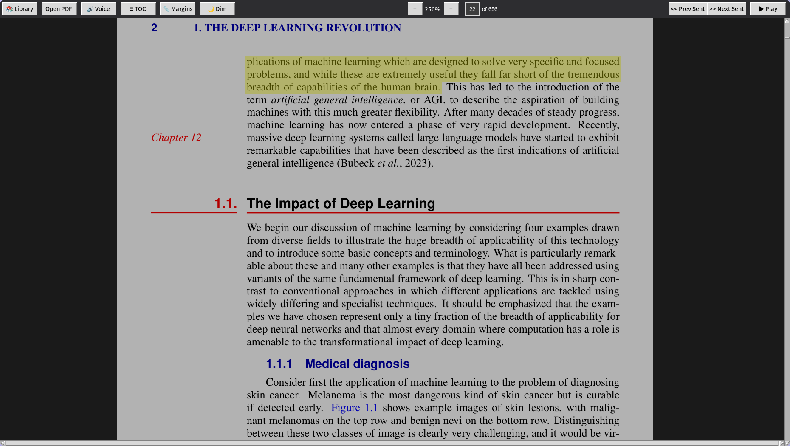

# PDFest - PDF Reader with TTS

A PDF reader with text-to-speech, continuous scrolling, and library management.



## Features

- 📖 Continuous scroll with lazy loading
- 🔊 Text-to-speech with sentence highlighting (Edge TTS)
- 📚 Library with thumbnails, search, and reading progress
- 🔍 Zoom in/out (0.5x - 4.0x)
- 📑 Table of contents sidebar (resizable)
- 💾 Auto-save reading position and zoom per book
- 📏 Configurable header/footer margins for TTS
- 🌙 Brightness filter (dim mode for eye comfort)
- 🔗 Clickable links (opens in browser)
- 📋 Text selection and copy
- ⌨️ Vim-style keyboard shortcuts
- 🤖 AI integration via Gemini web

## Keyboard Shortcuts

| Key | Action |
|-----|--------|
| **Space** / **p** | Play/Pause TTS |
| **h** | Previous sentence |
| **l** | Next sentence |
| **j** | Scroll down |
| **k** | Scroll up |
| **t** | Toggle TOC sidebar |
| **o** | Open library |
| **Ctrl+C** | Copy selected text |
| **a** | Open AI chat |

# Warning

- **This is a work in progress and it might not work as expected.**
- **This is python so it's slow and require a lot of memory (1GB+).**

## User Guide

### TTS Playback

- **▶ Play** starts reading from the visible page
- **⏸ Pause** stops immediately
- Sentences are highlighted in **yellow** as they're read
- Audio is pre-cached (5 sentences ahead) for smooth playback
- Pressing next/prev pauses playback for easy navigation

### TTS Margins

Click **📏 Margins** to exclude header/footer regions:
- Slide to adjust header (top) and footer (bottom) margins in points
- Red overlay previews the excluded zones
- Click **Apply** to save and re-analyze text

### Brightness / Dim Mode

Click **🌙 Dim** to reduce eye strain:
- Slider adjusts brightness from 30% to 100%
- Dark canvas background for comfortable reading
- Settings persist across sessions

### Voice Selection

Click **🔊 Voice** to choose from Edge TTS voices:
- Voices organized by language
- Selection is saved

### Library

Click **📚 Library** or press **o**:
- Books sorted by recently opened
- Search by title or path
- Thumbnails of first page
- Remove books from library

### Text Selection & Links

- Click and drag to select text, **Ctrl+C** to copy
- Click links to open in browser or jump to page

### AI Chat

- Click **🤖 AI** or press **a**:
- Select text to send context to AI
- Hold **Alt** to select as image

## Development

**With uv (recommended):**
```bash
uv run main.py
```

**With pip/venv:**
```bash
python -m venv .venv
source .venv/bin/activate  # Linux/Mac
# .venv\Scripts\activate   # Windows
pip install pymupdf edge-tts pygame pillow
python main.py
```

## Building

**With uv:**
```bash
uv add pyinstaller --dev
uv run pyinstaller --onefile --windowed --name pdfest \
  --hidden-import='PIL._tkinter_finder' \
  main.py
```

**With pip:**
```bash
pip install pyinstaller
pyinstaller --onefile --windowed --name pdfest \
  --hidden-import='PIL._tkinter_finder' \
  main.py
```

Output: `dist/pdfest`

## Installation

**Install system-wide (optional):**
```bash
sudo cp dist/pdfest /usr/local/bin/
```

## Data Location

- Library: `~/.local/pdfest/library.db`
- Settings: brightness, voice, margins (persisted)

## Known Issues

- When clicking on any button, the button will be kept focused and when you try to toggle tts with space it would also trigger the focused button click, to fix this you can click on the page navigation input and then click anywhere in the canvas to unfocus the button and then the space key will work as expected.
